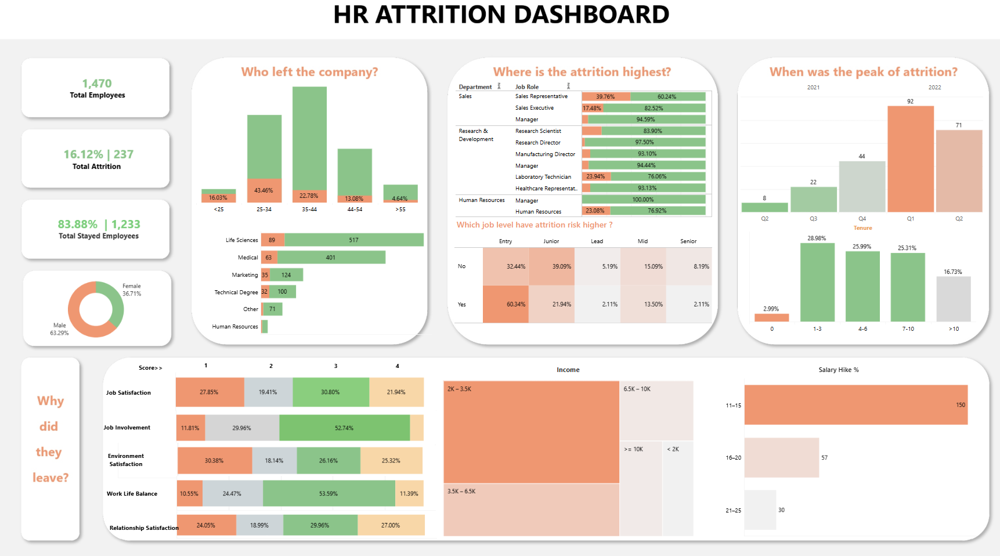

# 👥 Employee Churn Prediction Using Machine Learning

This project aims to apply Data Science techniques in Human Resource Management to predict employee attrition (churn) and provide insights to support employee retention strategies, especially in the IT sector.

## 🎯 Project Objective
To build a predictive model that identifies employees at risk of leaving the company and helps HR departments make data-driven decisions to improve retention.

## 🧠 Background
In the era of Industry 4.0, data-driven HR strategies are essential. This project explores how Data Science can be used to:
- Predict employee turnover
- Analyze key factors behind attrition
- Visualize HR data effectively
- Propose tailored retention policies

## 📊 Dataset
- Simulated or anonymized HR dataset (~14+ features)
- Key attributes: age, gender, department, salary level, years at company, training score, etc.

## 🛠️ Tools & Technologies
- **Language**: Python
- **Libraries**: pandas, numpy, seaborn, matplotlib, scikit-learn, xgboost
- **Visualization**: Power BI
- **Modeling**: Logistic Regression, Random Forest, XGBoost

## 📈 Workflow
1. Data preprocessing & cleaning
2. Exploratory Data Analysis (EDA)
3. Feature selection & importance ranking
4. Model training and evaluation
5. Dashboard creation for business insights

## ⚙️ Machine Learning Models
| Model                | Accuracy | ROC AUC | Precision | Recall |
|---------------------|----------|---------|-----------|--------|
| Logistic Regression | 81.2%    | 0.84    | 0.80      | 0.76   |
| Random Forest       | 88.4%    | 0.91    | 0.87      | 0.85   |
| XGBoost             | 89.1%    | 0.92    | 0.88      | 0.87   |

## 📌 Key Insights
- Employees with under 2 years of service have a significantly higher attrition rate.
- Technical departments see up to 2x the churn rate compared to administrative units.
- Lower-than-average salaries are strongly correlated with turnover.

## 📊 HR Dashboard (Power BI)
A dashboard was built to visualize:
- Attrition by department, tenure, salary group
- High-risk employee segments
- Suggestions for personalized retention policies

